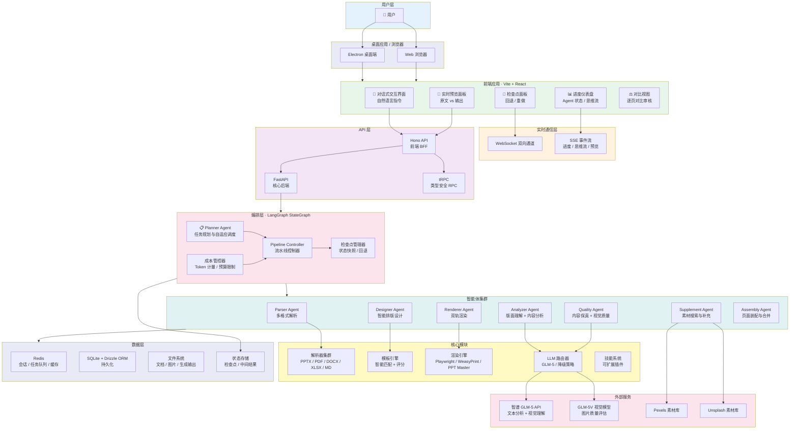
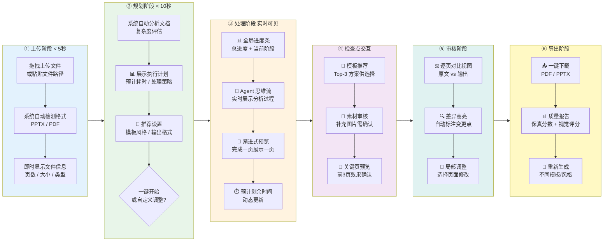
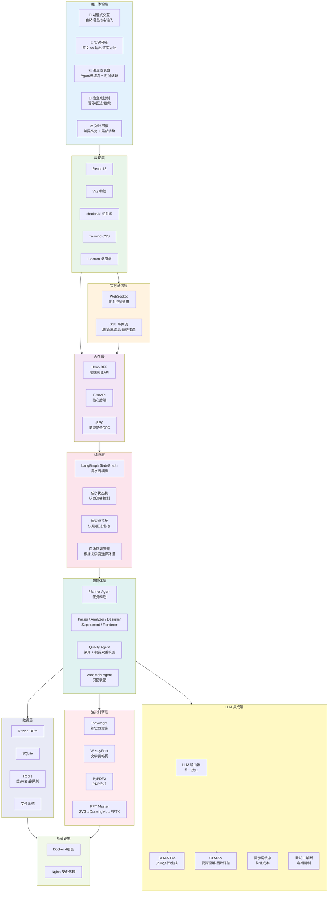
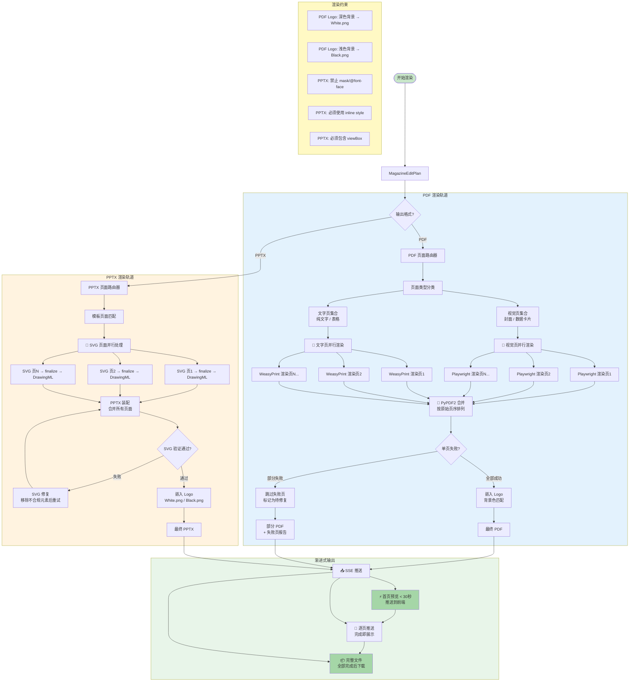
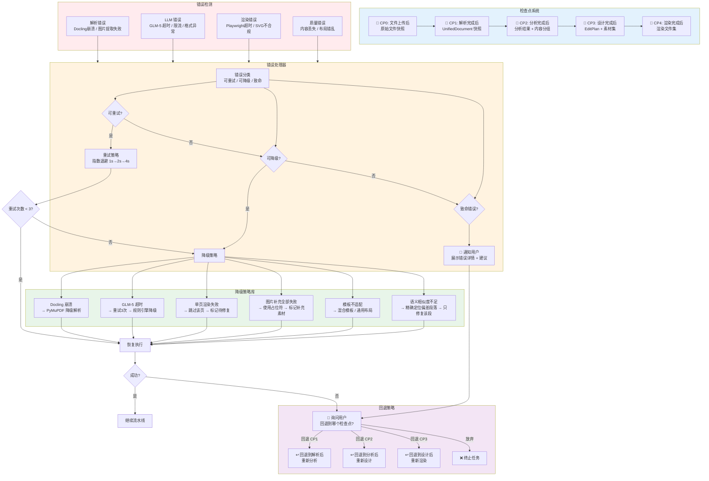

# 弘天文档 (HongTian Docs) — 系统架构图集 V2

> 杂志级文档重构智能体 · 完整任务落地架构
> 融合 Manus（自主执行）、Kimi（文档理解）、Claude Code（交互式落地）三大 AI Agent 设计理念

---

## 一、核心设计理念

### 从「工具」到「任务完成者」

| 维度 | V1 传统工具 | V2 任务落地架构（对标 Manus/Kimi/Claude Code） |
|------|------------|----------------------------------------------|
| 启动方式 | 用户配置参数后点"开始" | 上传文件即启动，自动分析并呈现执行计划 |
| 进度感知 | 转圈等待"处理中" | 实时流式展示每个 Agent 的思考过程和操作 |
| 质量保证 | 最后才校验 | 每个阶段都有验证门，问题尽早发现 |
| 用户交互 | 只有最终确认 | 关键决策点（模板、风格、素材）由用户参与 |
| 错误处理 | 失败就停 | 自动重试→降级策略→用户协商，三级恢复 |
| 输出节奏 | 全部完成才能看 | 首页预览 < 30秒，渐进式输出 |

---

## 二、架构图集（12 张图）

---

### 图 1：系统架构总览（System Architecture Overview）



---

### 图 2：智能任务执行流水线（Task Execution Pipeline）

> 融合 Claude Code 的「计划→执行→验证」循环 + Manus 的自主执行 + 关键用户检查点

```mermaid
flowchart TD
    Start([📥 用户上传文件<br/>PPTX / PDF]) --> Planner

    subgraph PlanPhase[Phase 0: 智能规划]
        Planner[📋 Planner Agent<br/>任务分析与自适应规划]
        Complexity[复杂度评估<br/>页数/图数/表格数/文字密度]
        PlanGeneration[生成执行计划<br/>预计耗时 / API 成本]
        AdaptivePath{文档复杂度?}

        Planner --> Complexity
        Complexity --> PlanGeneration
        PlanGeneration --> AdaptivePath

        AdaptivePath -->|简单 ≤10页| FastPath[⚡ 快速通道<br/>Parser → Designer → Renderer]
        AdaptivePath -->|中等 10-30页| StandardPath[📋 标准通道<br/>完整流水线]
        AdaptivePath -->|复杂 >30页| ParallelPath[🔄 并行通道<br/>分页并行处理]
    end

    PlanGeneration --> UserPlan[📱 展示执行计划给用户<br/>预计耗时 / 成本 / 处理策略]
    UserPlan --> UserApprove{用户确认?}
    UserApprove -->|确认| Checkpoint0
    UserApprove -->|调整| Planner

    Checkpoint0[🔖 检查点 0<br/>保存初始状态] --> ParserAgent

    subgraph ParsePhase[Phase 1: 解析与提取]
        ParserAgent[Parser Agent<br/>多格式路由解析]
        PptxRoute{PPTX?}
        PdfRoute{PDF?}

        ParserAgent --> PptxRoute
        ParserAgent --> PdfRoute

        PptxRoute -->|是| PptxParse[PPTX 深度解析<br/>内容 + 版式 + 母版 + 主题]
        PdfRoute -->|是| PdfParse[PDF 智能解析<br/>Docling子进程 → PyMuPDF降级]

        PptxParse --> UnifiedDoc
        PdfParse --> UnifiedDoc

        UnifiedDoc[📄 UnifiedDocument<br/>文本 + 图片 + 表格 + 版面结构]
    end

    UnifiedDoc --> Gate1

    subgraph Gate1[🚪 验证门 1: 解析完整性]
        Gate1Check{提取完整率 ≥98%?<br/>图片全部提取?<br/>表格数据无损?}
    end

    Gate1Check -->|通过 ✅| Checkpoint1
    Gate1Check -->|失败 ❌| Gate1Repair[修复策略<br/>重试解析 / 手动标注缺失]
    Gate1Repair --> ParserAgent

    Checkpoint1[🔖 检查点 1<br/>保存解析结果] --> AnalyzerAgent

    subgraph AnalyzePhase[Phase 2: 深度理解]
        AnalyzerAgent[Analyzer Agent<br/>三阶段深度分析]

        LayoutUnderstanding[📐 版面理解<br/>识别每页布局类型<br/>提取视觉层级]
        ContentClustering[📊 内容聚类<br/>按主题分组<br/>识别内容模式]
        SemanticLinkage[🔗 语义关联<br/>三重绑定策略<br/>空间+结构+GLM-5语义]
        QualityAssessment[🎯 素材质量评估<br/>图片分辨率/清晰度<br/>标记需补充素材]

        AnalyzerAgent --> LayoutUnderstanding
        AnalyzerAgent --> ContentClustering
        AnalyzerAgent --> SemanticLinkage
        AnalyzerAgent --> QualityAssessment

        LayoutUnderstanding --> AnalysisResult
        ContentClustering --> AnalysisResult
        SemanticLinkage --> AnalysisResult
        QualityAssessment --> AnalysisResult

        AnalysisResult[📋 分析报告<br/>内容分组 + 版面结构 + 素材评估]
    end

    AnalysisResult --> Gate2

    subgraph Gate2[🚪 验证门 2: 内容理解确认]
        Gate2Check{内容分组覆盖<br/>所有原始元素?}
    end

    Gate2Check -->|通过 ✅| Checkpoint2
    Gate2Check -->|失败 ❌| AnalyzerAgent

    Checkpoint2[🔖 检查点 2<br/>保存分析结果] --> ForkPoint

    ForkPoint{{🔀 并行分叉}} --> DesignerAgent
    ForkPoint --> SupplementAgent

    subgraph DesignPhase[Phase 3: 智能设计 · 并行分支 A]
        DesignerAgent[Designer Agent<br/>模板匹配 + 编辑动作生成]
        TemplateScore[📐 模板适配度评分<br/>候选模板 × 内容结构匹配]
        StyleTransfer[🎨 风格迁移<br/>提取原文档视觉风格]
        EditPlan[📝 编辑动作生成<br/>只替换不重写]
        UserTemplate[📱 模板推荐<br/>展示 Top-3 供用户选择]

        DesignerAgent --> TemplateScore
        DesignerAgent --> StyleTransfer
        TemplateScore --> UserTemplate
        UserTemplate --> EditPlan
        StyleTransfer --> EditPlan
        EditPlan --> DesignResult[📄 MagazineEditPlan]
    end

    subgraph SupplementPhase[Phase 3: 素材补充 · 并行分支 B]
        SupplementAgent[Supplement Agent<br/>素材搜索与 AI 增强]
        QualityFilter[🔍 质量过滤<br/>只补充高质量素材]
        SourceRank[📊 来源排序<br/>Pexels → Unsplash → AI 生图]
        SupplementResult[📄 补充素材集<br/>标记"补充素材"]
        UserSupplement[📱 素材审核<br/>用户确认补充的图片]

        SupplementAgent --> QualityFilter
        QualityFilter --> SourceRank
        SourceRank --> UserSupplement
        UserSupplement --> SupplementResult
    end

    DesignResult --> JoinPoint
    SupplementResult --> JoinPoint

    JoinPoint{{🔗 合并}} --> Checkpoint3

    Checkpoint3[🔖 检查点 3<br/>保存设计与素材] --> RendererAgent

    subgraph RenderPhase[Phase 4: 渲染生成]
        RendererAgent[Renderer Agent<br/>页级并行渲染]
        PageParallel[🔄 分页并行<br/>每页独立渲染]
        RenderQuality[🔍 渲染质量检查<br/>无溢出/无模糊/无重叠]
        ProgressiveOutput[📤 渐进式输出<br/>完成一页推送一页]

        RendererAgent --> PageParallel
        PageParallel --> RenderQuality
        RenderQuality --> ProgressiveOutput
        ProgressiveOutput --> RenderResult[📄 渲染结果集]
    end

    RenderResult --> Gate3

    subgraph Gate3[🚪 验证门 3: 渲染质量]
        Gate3Check{文字可读?<br/>图片清晰?<br/>布局合理?<br/>Logo 规范?}
    end

    Gate3Check -->|通过 ✅| Checkpoint4
    Gate3Check -->|失败 ❌| PageRepair[🔄 单页修复<br/>只修复失败页面]
    PageRepair --> RendererAgent

    Checkpoint4[🔖 检查点 4<br/>保存渲染结果] --> QualityAgent

    subgraph QualityPhase[Phase 5: 双重质量校验]
        QualityAgent[Quality Agent]

        subgraph ContentFidelity[内容保真校验]
            L1[L1 指纹完整性<br/>SHA256 哈希比对]
            L2[L2 图文关联<br/>三重绑定验证]
            L3[L3 语义保真<br/>GLM-5 相似度 ≥0.95]
        end

        subgraph VisualQuality[视觉质量校验]
            V1[V1 文字可读性<br/>无溢出/截断/乱码]
            V2[V2 图片清晰度<br/>无模糊/拉伸/失真]
            V3[V3 布局合理性<br/>间距/对齐/层级]
            V4[V4 Logo 规范性<br/>颜色匹配/位置正确]
        end

        L1 --> L2 --> L3
        V1 --> V2 --> V3 --> V4
    end

    L3 --> QualityPass{全部通过?}
    V4 --> QualityPass

    QualityPass -->|通过 ✅| AssemblyAgent
    QualityPass -->|失败 ❌| PreciseRepair[🎯 精准修复<br/>定位问题页面 → 只重试该页]
    PreciseRepair --> Checkpoint3

    subgraph AssemblyPhase[Phase 6: 装配与输出]
        AssemblyAgent[Assembly Agent<br/>页面装配 + 文件合并]
        LogoEmbed[嵌入弘天 Logo<br/>根据背景色自动选择]
        MetaWrite[写入元数据<br/>生成信息 / 保真报告]
        FinalOutput[📦 最终输出<br/>杂志级 PDF / PPTX]
        AssemblyAgent --> LogoEmbed --> MetaWrite --> FinalOutput
    end

    FinalOutput --> UserReview

    subgraph UserConfirm[Phase 7: 用户确认]
        UserReview[📱 对比预览<br/>原文 vs 输出 逐页对比]
        UserDecision{用户确认?}
        UserDecision -->|满意 ✅| Download[📥 下载文件]
        UserDecision -->|调整| AdjustFlow[🔧 局部调整<br/>选择页面 → 修改指令]
        AdjustFlow --> Checkpoint3
    end

    Download --> End([🎉 完成])

    style Start fill:#c8e6c9
    style End fill:#a5d6a7
    style Gate1 fill:#fff9c4
    style Gate2 fill:#fff9c4
    style Gate3 fill:#fff9c4
    style QualityPass fill:#fff9c4
    style UserApprove fill:#e1bee7
    style UserDecision fill:#e1bee7
    style Checkpoint0 fill:#b3e5fc
    style Checkpoint1 fill:#b3e5fc
    style Checkpoint2 fill:#b3e5fc
    style Checkpoint3 fill:#b3e5fc
    style Checkpoint4 fill:#b3e5fc
    style PlanPhase fill:#e3f2fd
    style ParsePhase fill:#e8f5e9
    style AnalyzePhase fill:#fff3e0
    style DesignPhase fill:#f3e5f5
    style SupplementPhase fill:#e0f2f1
    style RenderPhase fill:#ffebee
    style QualityPhase fill:#e8eaf6
    style AssemblyPhase fill:#f1f8e9
    style UserConfirm fill:#fce4ec
```

---

### 图 3：用户体验旅程图（User Experience Journey）

> 对标 Manus 的「一键启动」+ Kimi 的「即时反馈」+ Claude Code 的「交互式落地」



---

### 图 4：Planner Agent 智能规划（Intelligent Planning）

> 对标 Claude Code 的「Plan Mode」— 先计划再执行

```mermaid
flowchart TD
    Input([文件上传完成]) --> QuickScan

    subgraph Scan[快速扫描 < 5秒]
        QuickScan[快速扫描<br/>读取元数据 + 前3页样本]
        FormatDetect[格式检测<br/>PPTX / PDF]
        PageCount[页数统计<br/>总页数 / 图片数 / 表格数]
        QuickScan --> FormatDetect --> PageCount
    end

    PageCount --> ComplexityScore

    subgraph Assess[复杂度评估]
        ComplexityScore[复杂度评分算法]
        TextDensity[文字密度<br/>每页平均字数]
        ImageRatio[图片占比<br/>图片页 / 总页数]
        TableComplexity[表格复杂度<br/>行列数 / 合并单元格]
        LayoutDiversity[布局多样性<br/>不同版式类型数]

        ComplexityScore --> TextDensity
        ComplexityScore --> ImageRatio
        ComplexityScore --> TableComplexity
        ComplexityScore --> LayoutDiversity
    end

    TextDensity --> FinalScore
    ImageRatio --> FinalScore
    TableComplexity --> FinalScore
    LayoutDiversity --> FinalScore

    FinalScore[综合评分 0-100] --> PathSelect

    subgraph PathSelection[自适应路径选择]
        PathSelect{评分区间?}
        PathSelect -->|0-30 简单| Fast[⚡ 快速通道<br/>跳过 Analyzer 深度分析<br/>直接模板匹配 + 渲染<br/>预计 < 1分钟]
        PathSelect -->|31-70 中等| Standard[📋 标准通道<br/>完整 6 Agent 流水线<br/>预计 2-5 分钟]
        PathSelect -->|71-100 复杂| Deep[🔬 深度通道<br/>分页并行 + 多轮设计<br/>预计 5-15 分钟]
    end

    Fast --> PlanOutput
    Standard --> PlanOutput
    Deep --> PlanOutput

    subgraph Plan[执行计划生成]
        PlanOutput[📋 执行计划]
        TimeEstimate[预计耗时<br/>基于历史数据估算]
        CostEstimate[预计 API 成本<br/>GLM-5 调用次数 × 单价]
        CheckpointList[检查点列表<br/>哪些节点需要用户确认]
        RiskAlert[风险提示<br/>低质量图片 / 复杂表格 / 生僻字体]

        PlanOutput --> TimeEstimate
        PlanOutput --> CostEstimate
        PlanOutput --> CheckpointList
        PlanOutput --> RiskAlert
    end

    TimeEstimate --> UserPlan
    CostEstimate --> UserPlan
    CheckpointList --> UserPlan
    RiskAlert --> UserPlan

    UserPlan[📱 向用户展示执行计划] --> Execute

    subgraph Execute[执行控制]
        Execute[开始执行]
        DraftMode{启用草稿模式?}
        DraftMode -->|是| Draft[📝 草稿模式<br/>低分辨率快速预览<br/>确认方向后再全质量渲染]
        DraftMode -->|否| FullRun[🚀 全质量运行]

        Draft --> UserDraftConfirm{方向正确?}
        UserDraftConfirm -->|是| FullRun
        UserDraftConfirm -->|否| AdjustPlan[调整计划] --> PlanOutput
        UserDraftConfirm -->|换模板| TemplateChange[更换模板] --> Draft
    end

    FullRun --> StartPipeline([启动流水线])

    style Input fill:#c8e6c9
    style StartPipeline fill:#a5d6a7
    style Fast fill:#e8f5e9
    style Standard fill:#fff3e0
    style Deep fill:#ffebee
    style DraftMode fill:#e1bee7
    style UserDraftConfirm fill:#e1bee7
    style UserPlan fill:#b3e5fc
```

---

### 图 5：数据模型关系（Enhanced Data Model）

> 增强字段支撑版面理解、质量评估、渐进式输出

```mermaid
erDiagram
    UnifiedDocument ||--o{ TextElement : contains
    UnifiedDocument ||--o{ ImageElement : contains
    UnifiedDocument ||--o{ TableElement : contains
    UnifiedDocument ||--o{ PageLayout : has
    UnifiedDocument ||--o{ ContentAssetLink : has
    UnifiedDocument ||--|| ContentFingerprint : has

    UnifiedDocument {
        string id PK
        string source_file
        string source_format "pptx | pdf"
        string title
        int total_pages
        string parse_method
        float complexity_score "0-100, Planner评估"
        string processing_path "fast | standard | deep"
        datetime created_at
    }

    TextElement {
        string id PK
        string content "原始文字,不改一个字"
        int page
        BoundingBox bbox
        int level "0=正文,1=标题,2=副标题"
        string fingerprint "MD5(content)"
        string original_font "原始字体"
        float original_size "原始字号pt"
        string original_color "原始颜色hex"
        int reading_order "阅读顺序索引"
        float importance "视觉重要性 0-1"
    }

    ImageElement {
        string id PK
        string local_path "本地文件路径"
        int page
        BoundingBox bbox
        int width_px "像素宽度"
        int height_px "像素高度"
        int dpi "图片DPI"
        float quality_score "0-1, GLM-5V评估"
        boolean needs_supplement "是否需要补充"
        string hash "文件MD5"
        string alt_text "图片描述"
        string supplement_source "original | pexels | unsplash | ai_generated"
    }

    TableElement {
        string id PK
        int page
        BoundingBox bbox
        json data "二维数组"
        list headers "表头"
        boolean is_chart "是否图表数据"
    }

    PageLayout {
        string id PK
        int page_number
        string layout_type "cover | text_image | data_card | two_column | full_text"
        json visual_hierarchy "元素ID按重要性排序"
        float whitespace_ratio "留白比例"
        string dominant_color "主色调"
        json original_structure "原始版式结构描述"
    }

    ContentAssetLink {
        string id PK
        string text_id FK
        string asset_id FK "image或table的ID"
        string asset_type "image | table"
        string strategy "spatial | structural | semantic"
        float confidence "0-1"
        boolean bidirectional "双向关联标记"
    }

    ContentFingerprint {
        string id PK
        json text_fingerprints "text_id → MD5"
        json image_hashes "image_id → MD5"
        int text_count
        int image_count
        int table_count
        int total_chars
    }

    MagazineEditPlan ||--o{ SlideEditPlan : contains
    MagazineEditPlan ||--|| DesignSpec : defines
    MagazineEditPlan ||--|| ContentFingerprint : references

    MagazineEditPlan {
        string id PK
        string document_id FK
        string template_id
        string template_name
        string output_format "pdf | pptx"
        float template_fit_score "模板适配度 0-1"
        json original_fingerprint "原文指纹"
    }

    SlideEditPlan ||--o{ EditAction : contains

    SlideEditPlan {
        string id PK
        int page_number
        string layout_type "封面/文字/图文/数据"
        string template_page "模板页面标识"
        string notes "设计备注"
    }

    EditAction {
        string id PK
        string type "replace_text | replace_image | replace_table | validate"
        string target_selector "CSS选择器/占位符"
        string source_id "UnifiedDocument元素ID"
        string content "替换内容原文"
        float confidence
    }

    DesignSpec ||--|| ColorScheme : has
    DesignSpec ||--|| Typography : has

    DesignSpec {
        string id PK
        string style "modern_tech | elegant_minimal | business_professional"
        string canvas_format "ppt169 | a4"
        int canvas_width
        int canvas_height
        string source_style "original:提取自原文 | template:模板自带"
    }

    ColorScheme {
        string id PK
        string primary
        string secondary
        string accent
        string background
        string text
        string muted
    }

    Typography {
        string id PK
        string title_font
        string body_font
        int title_size
        int subtitle_size
        int body_size
        int caption_size
    }

    TaskState ||--|| UnifiedDocument : tracks

    TaskState {
        string id PK
        string status "uploaded→planning→parsing→...→completed"
        string current_phase "当前阶段"
        int current_page "当前处理页"
        int total_pages "总页数"
        float progress "0-100"
        json checkpoints "检查点快照列表"
        json error_log "错误记录"
        float api_cost "API费用累计"
        datetime estimated_completion "预计完成时间"
    }
```



---

### 图 6：技术栈（Technology Stack）



---

### 图 7：双轨渲染引擎（Enhanced Dual-Track Rendering）

> 增加页级并行 + 渐进式输出 + 单页失败隔离



---

### 图 8：文件格式智能解析（Intelligent Format Parsing）

> PPTX 增加版式/母版/主题提取；PDF 增加 OCR 降级

```mermaid
flowchart TD
    Start([上传文件]) --> Detect[格式检测 + 文件大小]

    Detect --> Format{文件类型?}

    subgraph PptxFlow[PPTX 深度解析]
        Format -->|.pptx| PptxLoad[python-pptx 加载]

        PptxLoad --> PptxContent[内容提取]
        PptxLoad --> PptxLayout[📐 版式信息提取]
        PptxLoad --> PptxTheme[🎨 主题配色提取]
        PptxLoad --> PptxMaster[📐 母版布局提取]

        PptxContent --> PText[文本元素<br/>保留原始字体/大小/颜色]
        PptxContent --> PImage[图片元素<br/>提取到本地 + 计算MD5]
        PptxContent --> PTable[表格元素<br/>二维数组 + 合并单元格信息]

        PptxLayout --> PPageLayout[PageLayout<br/>每页布局类型/视觉层级]
        PptxTheme --> PColorScheme[原始 ColorScheme<br/>作为 Designer 参考]
        PptxMaster --> PMasterLayout[母版占位符映射<br/>模板匹配时使用]

        PText --> PptxDoc
        PImage --> PptxDoc
        PTable --> PptxDoc
        PPageLayout --> PptxDoc
        PColorScheme --> PptxDoc
        PMasterLayout --> PptxDoc

        PptxDoc[UnifiedDocument<br/>+ PageLayout + 原始主题]
    end

    subgraph PdfFlow[PDF 智能解析]
        Format -->|.pdf| PdfSize{文件大小?}

        PdfSize -->|< 50MB| DoclingTry[尝试 Docling 解析<br/>子进程隔离]
        PdfSize -->|≥ 50MB| PyMuPDFDirect[直接 PyMuPDF<br/>大文件优化]

        DoclingTry --> DoclingOK{Docling 成功?}
        DoclingOK -->|是| DoclingExtract[Docling 提取<br/>文本/图片/表格/布局]
        DoclingOK -->|否| PyMuPDFFallback[降级 PyMuPDF]

        DoclingExtract --> PdfQuality[图片质量评估<br/>DPI / 分辨率检测]
        PyMuPDFFallback --> PdfQuality
        PyMuPDFDirect --> PdfQuality

        PdfQuality --> LowQImage{低质量图片?}
        LowQImage -->|是| MarkSupplement[标记 needs_supplement=true]
        LowQImage -->|否| PdfLinkage[图文关联分析<br/>三重绑定]

        MarkSupplement --> PdfLinkage
        PdfLinkage --> PdfDoc[UnifiedDocument<br/>+ 质量评估标记]
    end

    PptxDoc --> ParseValidation
    PdfDoc --> ParseValidation

    subgraph ParseValidation[解析完整性校验]
        ParseValidation[Gate 1: 解析验证]
        TextCheck{文本提取率 ≥98%?}
        ImageCheck{图片全部提取?}
        FingerprintCheck[计算内容指纹<br/>SHA256 哈希集]

        ParseValidation --> TextCheck
        TextCheck -->|通过| ImageCheck
        TextCheck -->|失败| ParseRetry[标记缺失项<br/>尝试补充提取]
        ParseRetry --> TextCheck

        ImageCheck -->|通过| FingerprintCheck
        ImageCheck -->|失败| ImageMark[标记缺失图片<br/>needs_supplement=true]
        ImageMark --> FingerprintCheck

        FingerprintCheck --> ParseOK([✅ 解析完成])
    end

    ParseOK --> Output[输出 UnifiedDocument]

    style Start fill:#c8e6c9
    style ParseOK fill:#a5d6a7
    style Output fill:#a5d6a7
    style PptxFlow fill:#e3f2fd
    style PdfFlow fill:#fff3e0
    style ParseValidation fill:#e8f5e9
    style TextCheck fill:#fff9c4
    style ImageCheck fill:#fff9c4
```

---

### 图 9：双重质量校验体系（Dual Quality Assurance）

> 内容保真（L1-L3）+ 视觉质量（V1-V4）+ 精准修复

```mermaid
flowchart TD
    Start([渲染完成]) --> QualityEntry

    subgraph ContentQA[内容保真校验 · 不可妥协]
        QualityEntry[Quality Agent 入口]
        QualityEntry --> L1

        L1[L1 指纹完整性<br/>逐片段 SHA256 比对]
        L1 --> L1Result{所有哈希匹配?}
        L1Result -->|是| L2
        L1Result -->|否| L1Report[生成缺失报告<br/>列出丢失的文字片段]

        L2[L2 图文关联完整性<br/>每张原始图片必须有归属]
        L2 --> L2Result{所有图片关联?}
        L2Result -->|是| L3
        L2Result -->|否| L2Report[生成孤图报告<br/>列出未关联的图片]

        L3[L3 语义保真<br/>GLM-5 逐段对比]
        L3 --> L3Result{相似度 ≥0.95?}
        L3Result -->|是| ContentPass[✅ 内容保真通过]
        L3Result -->|否| L3Report[生成偏差报告<br/>高亮语义变化点]
    end

    ContentPass --> VisualQA

    subgraph VisualQA[视觉质量校验 · 杂志级标准]
        VisualQA[视觉质量入口]

        V1[V1 文字可读性<br/>溢出/截断/乱码/遮挡检测]
        V1 --> V1Result{文字全部可读?}
        V1Result -->|是| V2
        V1Result -->|否| V1Issue[定位问题页面<br/>记录溢出位置]

        V2[V2 图片清晰度<br/>模糊/拉伸/失真检测]
        V2 --> V2Result{图片全部清晰?}
        V2Result -->|是| V3
        V2Result -->|否| V2Issue[标记低质量图片<br/>建议补充/替换]

        V3[V3 布局合理性<br/>间距/对齐/层级检测]
        V3 --> V3Result{布局合理?}
        V3Result -->|是| V4
        V3Result -->|否| V3Issue[标注布局问题<br/>间距过大/元素重叠]

        V4[V4 Logo 规范性<br/>弘天品牌合规]
        V4 --> V4Result{Logo 合规?}
        V4Result -->|是| VisualPass[✅ 视觉质量通过]
        V4Result -->|否| V4Issue[Logo 修正<br/>颜色/位置/大小]
    end

    VisualPass --> L4Confirm

    subgraph HumanConfirm[L4 人工确认]
        L4Confirm[L4 用户审核]
        GenerateReport[生成对比报告<br/>原文 vs 输出 逐页对比]
        ShowReport[📱 前端展示<br/>差异高亮 + 质量评分]
        UserReview{用户确认?}

        L4Confirm --> GenerateReport --> ShowReport --> UserReview
    end

    UserReview -->|确认 ✅| Success([🎉 质量通过<br/>可以输出])
    UserReview -->|局部调整| AdjustMode
    UserReview -->|拒绝| FullRepair

    subgraph Repair[精准修复策略]
        FullRepair[🔄 全量修复<br/>回退到 Designer Agent]
        AdjustMode[🔧 局部修复<br/>用户指定页面 → 只重试该页]

        FullRepair --> RetryCount
        AdjustMode --> TargetedRetry

        RetryCount{重试次数<br/>< MAX_REPAIR_ATTEMPTS?}
        TargetedRetry[目标页面重试<br/>只重新设计和渲染指定页]

        RetryCount -->|未超限| DesignerAgent[→ Designer Agent]
        RetryCount -->|超限| FailFinal([❌ 超过最大重试])
        TargetedRetry --> DesignerAgent
    end

    L1Report --> RetryCount
    L2Report --> RetryCount
    L3Report --> RetryCount
    V1Issue --> TargetedRetry
    V2Issue --> TargetedRetry
    V3Issue --> TargetedRetry
    V4Issue --> TargetedRetry

    style Start fill:#c8e6c9
    style Success fill:#a5d6a7
    style FailFinal fill:#ef9a9a
    style ContentQA fill:#e3f2fd
    style VisualQA fill:#fff3e0
    style HumanConfirm fill:#e8f5e9
    style Repair fill:#ffebee
    style L1Result fill:#fff9c4
    style L2Result fill:#fff9c4
    style L3Result fill:#fff9c4
    style V1Result fill:#fff9c4
    style V2Result fill:#fff9c4
    style V3Result fill:#fff9c4
    style V4Result fill:#fff9c4
    style UserReview fill:#e1bee7
```

---

### 图 10：任务状态机（Task State Machine）

> 每个状态都可回退到最近的检查点

```mermaid
stateDiagram-v2
    [*] --> Uploaded : 文件上传完成

    Uploaded --> Planning : Planner Agent 启动
    Planning --> Planned : 执行计划生成
    Planned --> Planning : 用户调整计划

    Planned --> Parsing : 用户确认开始
    Parsing --> Parsed : 解析完成
    Parsing --> ParseFailed : 解析失败

    ParseFailed --> Parsing : 重试
    ParseFailed --> Paused : 降级处理需用户确认

    Parsed --> Analyzing : Gate 1 通过
    Parsed --> Parsing : Gate 1 失败→修复重试

    Analyzing --> Analyzed : 分析完成
    Analyzed --> Designing : Gate 2 通过
    Analyzing --> Analyzing : Gate 2 失败→重新分析

    Designing --> Designed : 设计完成
    Designed --> Rendering : 检查点 3 保存

    Supplementing --> Supplemented : 素材就绪
    Supplemented --> Rendering : 合并点

    Rendering --> Rendered : 渲染完成
    Rendered --> QualityChecking : Gate 3 通过
    Rendering --> Rendering : Gate 3 失败→单页修复

    QualityChecking --> QualityPassed : L1-L3 + V1-V4 全通过
    QualityChecking --> Repairing : 校验失败

    Repairing --> Designing : 重试未超限
    Repairing --> Failed : 超过最大重试次数

    QualityPassed --> Assembling : 装配开始
    Assembling --> AwaitingConfirm : 装配完成

    AwaitingConfirm --> Confirmed : L4 用户确认
    AwaitingConfirm --> Adjusting : 用户要求调整
    Adjusting --> Designing : 局部重设计
    AwaitingConfirm --> Failed : 用户拒绝

    Confirmed --> Completed : 文件生成
    Completed --> [*]

    Failed --> [*]

    %% 暂停与恢复
    Paused --> Planning : 用户恢复
    AnyState --> Paused : 用户暂停

    note right of Planned: 检查点 0: 初始状态
    note right of Parsed: 检查点 1: 解析结果
    note right of Analyzed: 检查点 2: 分析结果
    note right of Designed: 检查点 3: 设计方案
    note right of Rendered: 检查点 4: 渲染结果
```

---

### 图 11：实时通信与进度推送（Real-time Communication）

> 对标 Manus 的「思维流」+ Claude Code 的「实时反馈」

```mermaid
flowchart LR
    subgraph Backend[后端事件源]
        AgentStatus[Agent 状态变更]
        Thinking[Agent 思维流<br/>"正在分析第3页版面...<br/>检测到图文混排布局"]
        PagePreview[页面预览图<br/>渲染完成的页面缩略图]
        ProgressNum[进度数字<br/>当前页/总页 + 百分比]
        QualityScore[质量评分<br/>保真分数 + 视觉评分]
        CostUpdate[成本更新<br/>Token消耗 + 费用]
        CheckpointEvent[检查点事件<br/>需要用户确认]
        ErrorEvent[错误事件<br/>失败详情 + 建议操作]
    end

    subgraph Transport[传输层]
        SSEChannel[SSE 事件流<br/>单向推送: 进度/思维/预览]
        WSChannel[WebSocket<br/>双向: 控制/确认/调整]
    end

    subgraph Frontend[前端消费端]
        ProgressStore[Zustand Progress Store<br/>进度状态管理]

        subgraph UI[用户界面组件]
            GlobalProgress[📊 全局进度条<br/>阶段 + 百分比 + 预计剩余]
            AgentThinking[💬 Agent 思维流面板<br/>滚动展示分析过程]
            PageThumbnails[📄 页面缩略图网格<br/>完成即亮起]
            QualityPanel[📊 质量仪表盘<br/>实时评分更新]
            CostDisplay[💰 成本显示<br/>累计 API 费用]
            ControlBar[⏸️ 控制栏<br/>暂停/继续/回退/取消]
        end

        ProgressStore --> UI
    end

    AgentStatus --> SSEChannel
    Thinking --> SSEChannel
    PagePreview --> SSEChannel
    ProgressNum --> SSEChannel
    QualityScore --> SSEChannel
    CostUpdate --> SSEChannel
    CheckpointEvent --> WSChannel
    ErrorEvent --> WSChannel

    SSEChannel --> ProgressStore
    WSChannel --> ProgressStore

    ControlBar -->|暂停/回退/取消| WSChannel
    WSChannel -->|确认/调整| Backend

    style Backend fill:#e3f2fd
    style Transport fill:#fff3e0
    style Frontend fill:#e8f5e9
    style UI fill:#f1f8e9
```

---

### 图 12：错误恢复与检查点策略（Error Recovery & Checkpoint Strategy）

> 对标 Claude Code 的「rewind」+ Manus 的「自动修复」



---

## 三、对比总结：V1 → V2 架构升级要点

| 维度 | V1 原始架构 | V2 任务落地架构 | 灵感来源 |
|------|------------|----------------|---------|
| 启动 | 配置参数后手动启动 | 上传即分析，自动呈现执行计划 | Claude Code Plan Mode |
| 规划 | 无规划，直接执行 | Planner Agent 评估复杂度，自适应选择路径 | Claude Code Plan Mode |
| 进度 | 转圈等待 | 实时思维流 + 逐页推送 + 预计剩余时间 | Manus Stream of Thought |
| 校验 | 最后 Fidelity Agent 校验 | 3 个 Validation Gate + 双重质量校验 | Claude Code Verification |
| 交互 | 只有最终确认 | 4 个用户检查点（模板/素材/预览/最终） | Claude Code Interactive |
| 并行 | 顺序执行 | Designer ∥ Supplement + 页级并行渲染 | Manus Parallel Execution |
| 容错 | 失败即停 | 重试→降级→用户协商，三级恢复 | Claude Code Rewind |
| 回退 | 无回退机制 | 5 个检查点，任意回退 | Claude Code Checkpoint |
| PPTX解析 | 只提内容 | 内容 + 版式 + 母版 + 主题配色 | Kimi 深度文档理解 |
| 质量评估 | 仅内容保真 | 内容保真（L1-L3）+ 视觉质量（V1-V4） | Manus Quality Gate |
| 新增Agent | 5 个 | 8 个（+Planner/Assembly/Quality） | 系统性设计 |
| 数据模型 | 基础字段 | +版面结构/质量评分/阅读顺序/字体信息 | Kimi 结构化理解 |

---

## 四、图表使用说明

### 渲染工具
- [Mermaid Live Editor](https://mermaid.live/) 在线预览
- VS Code 安装 `Markdown Preview Mermaid Support` 插件
- GitHub/GitLab/Notion 原生支持

### 导出格式
- SVG: 矢量图，无损缩放
- PNG: 位图，适合文档插入
- PDF: 打印友好

### 版本信息
- Mermaid ≥ 10.0.0
- V2 架构版本：2026-05-24
- 融合 Manus / Kimi / Claude Code 设计理念
